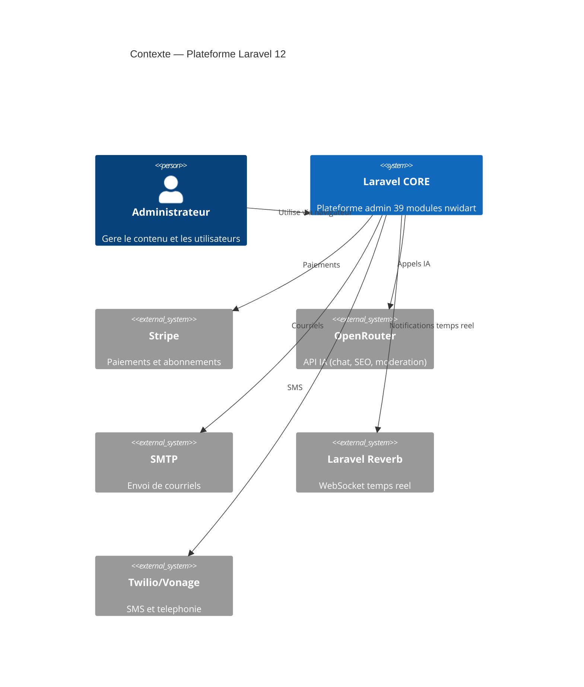
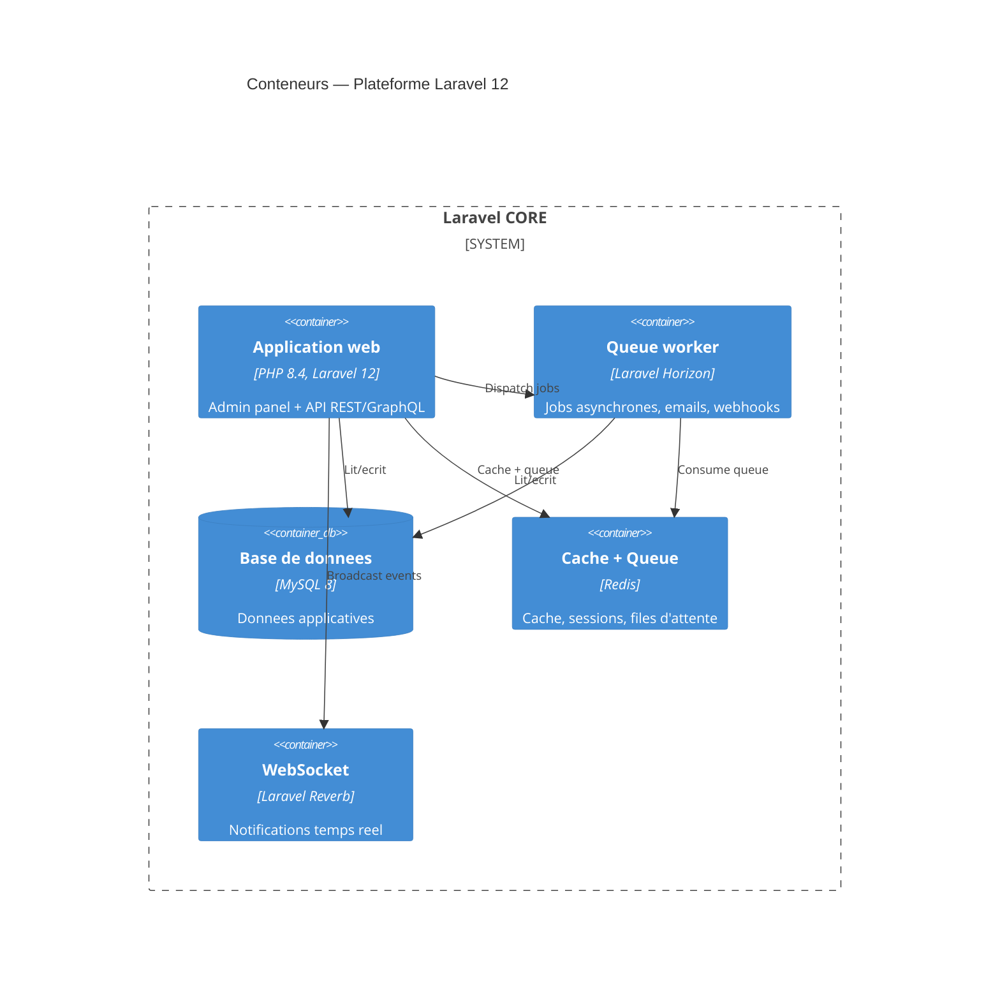
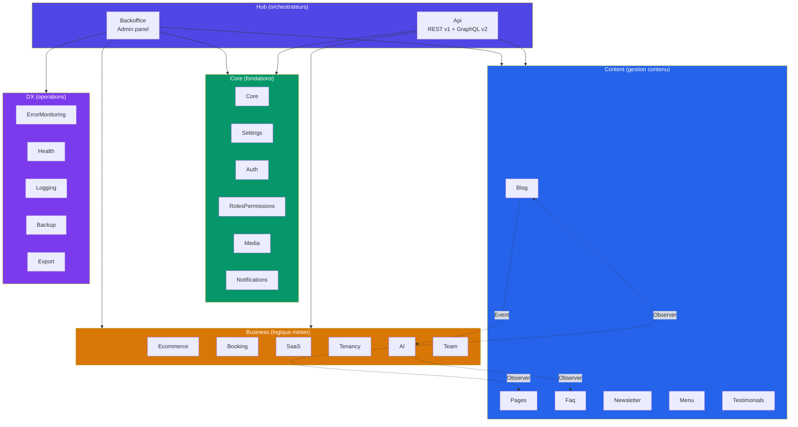

# Architecture C4 — Laravel CORE template

> Auteur : MEMORA solutions
> Derniere mise a jour : 2026-04-04

## 1. Diagramme de contexte

## 2. Diagramme de conteneurs

## 3. Diagramme de composants (modules)

## Regles de communication

- **Hub** (Backoffice, Api) peut importer tous les modules
- **Core** est importable par tous
- **Business** modules sont isoles (pas d'import croise)
- Communication inter-business uniquement via **Events/Listeners** avec `class_exists()` guard
- Voir `COMMUNICATION_MAP.md` pour la matrice detaillee
